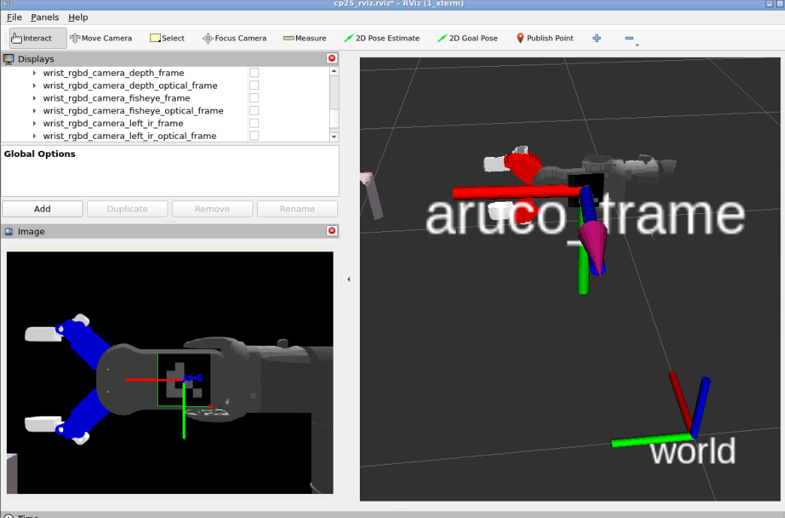

# Checkpoint25_final_project

## Task 1. Simulation Moveit configuration


### Run simulation

```
source ~/ros2_ws/install/setup.bash
ros2 launch the_construct_office_gazebo starbots_ur3e.launch.xml
```

Check if controllers are loaded successfully

```
ros2 control list_controllers
```

### Run Moveit

Terminal 2

```
cd ~/ros2_ws
source install/setup.bash
```

```
source install/setup.bash; ros2 launch my_moveit_config move_group.launch.py
```

Terminal 3

```
cd ~/ros2_ws
source install/setup.bash
```

```
source install/setup.bash; ros2 launch my_moveit_config moveit_rviz.launch.py
```


Terminal 4

```
cd ~/ros2_ws
source install/setup.bash
```

```
source install/setup.bash; ros2 launch moveit2_scripts test_trajectory.launch.py
```

Terminal 5

```
cd ~/ros2_ws
source install/setup.bash
```

```
source install/setup.bash; ros2 run my_tf_aruco aruco_to_camlink_tf_pub.py
```


to View TF frames

```
ros2 run tf2_tools view_frames
```

Terminal 6

To view RVIZ2 Camera 

```
cd ~/ros2_ws/src/Checkpoint25_final_project/
rviz2 -d rviz/cp25_rviz.rviz
```


### Important files

world file

~/ros2_ws/src/universal_robot_ros2/the_construct_office_gazebo/worlds/starbots_complete.world

robot xacro file

~/ros2_ws/src/universal_robot_ros2/Universal_Robots_ROS2_Description/urdf/ur.urdf.xacro

use blender to view 3d dae files.

### Working on, and Next step 

- currently I change the camera position to see the aruco mark clearly, to proof of concept that I can do this project with this method
- The result is promising, see the result



- It looks like a proof of concept. Check the error value of the proof of concept
- If it is proven, do the robot arm path planning and moving the robot arm to show the aruco marks to the original camera position

# Real Robot

Terminal 1

```
cd ~/ros2_ws/
source install/setup.bash; ros2 launch real_moveit_config move_group.launch.py
```

Terminal 2

```
cd ~/ros2_ws/
source install/setup.bash; ros2 launch real_moveit_config moveit_rviz.launch.py
```


# Devop

Terminal 1: Rosbridge

This Rosbridge provide JSON connection to web browser

```
ros2 launch rosbridge_server  main_rosbridge_launch.py
```

Terminal 2: Http server 

Installation 

```
cd ~/webpage_ws/
ln -s ~/ros2_ws/src/Checkpoint25_final_project/cp25_webapp .
```

```
cd ~/webpage_ws/cp25_webapp
python3 -m http.server 7000
```

