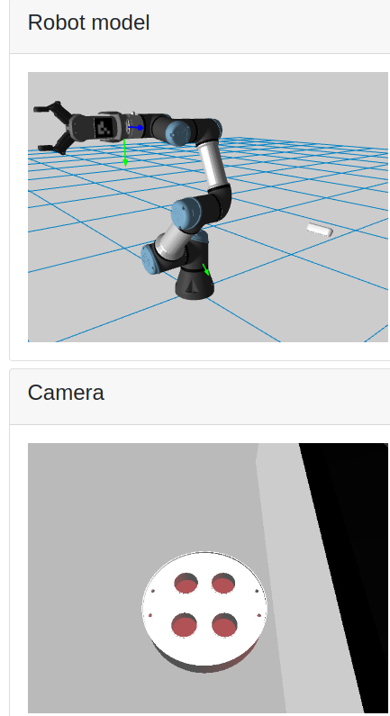

# Checkpoint25_final_project

## Fast solutution


```
git clone <this repo git addr>
cd Checkpoint25_final_project/Docker_sim/Checkpoint25
docker compose up
```
then Open your web browser to 

```
localhost:7000
```

or 

```
<local ip address>:7000
```

## Task 1. Simulation Moveit configuration


### Run simulation

```
source ~/ros2_ws/install/setup.bash
ros2 launch the_construct_office_gazebo starbots_ur3e.launch.xml
```

Check if controllers are loaded successfully

```
ros2 control list_controllers
```

### Run Moveit

Terminal 2

```
cd ~/ros2_ws
source install/setup.bash
```

```
source install/setup.bash; ros2 launch my_moveit_config move_group.launch.py
```

Terminal 3

```
cd ~/ros2_ws
source install/setup.bash
```

```
source install/setup.bash; ros2 launch my_moveit_config moveit_rviz.launch.py
```


Terminal 4

```
cd ~/ros2_ws
source install/setup.bash
```

```
source install/setup.bash; ros2 launch moveit2_scripts move_sim_arm_to_show_aruco_trajectory.launch.py
```

Terminal 5

```
cd ~/ros2_ws
source install/setup.bash
```

```
source install/setup.bash; ros2 run my_tf_aruco aruco_to_camlink_tf_pub.py
```


to View TF frames

```
ros2 run tf2_tools view_frames
```

Terminal 6

To view RVIZ2 Camera 

```
cd ~/ros2_ws/src/Checkpoint25_final_project/
rviz2 -d rviz/cp25_rviz.rviz
```


### Important files

world file

~/ros2_ws/src/universal_robot_ros2/the_construct_office_gazebo/worlds/starbots_complete.world

robot xacro file

~/ros2_ws/src/universal_robot_ros2/Universal_Robots_ROS2_Description/urdf/ur.urdf.xacro

use blender to view 3d dae files.


# Real Robot

Terminal 1

```
cd ~/ros2_ws/
source install/setup.bash; ros2 launch real_moveit_config move_group.launch.py
```

Terminal 2

```
cd ~/ros2_ws/
source install/setup.bash; ros2 launch real_moveit_config moveit_rviz.launch.py
```

Terminal 3

```
cd ~/ros2_ws/
source install/setup.bash; ros2 launch moveit2_scripts move_real_arm_to_show_aruco_trajectory.launch.py
```

Terminal 4

```
cd ~/ros2_ws/src/Checkpoint25_final_project/
rviz2 -d rviz/cp25_realrobot_rviz.rviz
```

# Devop

Terminal 1: Rosbridge

This Rosbridge provide JSON connection to web browser

```
ros2 launch rosbridge_server  main_rosbridge_launch.py
```

Terminal 2: Http server 

Installation 

```
cd ~/webpage_ws/
ln -s ~/ros2_ws/src/Checkpoint25_final_project/cp25_webapp .
```

```
cd ~/webpage_ws/cp25_webapp
python3 -m http.server 7000
```


### Working on, and Next step 

- Task 1 solved. Move robot to the correct position, broadcast aruco_TF, and show the axes on aruco image.


- Real Robot
    - successfully move real robot to the correct position, but cannot see the image inside the image topic.
    - waiting for theConstruct to solve the image topic for me.

- Devop
    - Done ROS2 -> r1_bridge -> r1_web_bridge -> web, with moveit able to control, and web able to show moving robot arm.
    - TODO NEXT: 
        -   Web control robot arms into two position: 1) Home, 2) show_aruco (move_sim_arm_to_show_aruco_trajectory.launch.py)
        -   docker run the aruco_detector (ros2 run my_tf_aruco aruco_to_camlink_tf_pub.py)
        -   Show the aruco marker w.r.t. Camera in X,Y,Z, Yaw, Pitch, Row
        
Terminal 1

```
cd ~/MyRobotics/Checkpoint25/Checkpoint25_final_project/Docker_sim/dockerRos2USBcam_dockerRos1Bridge_dockerRos1WebBridge_webShowImage
docker compose -f docker-compose_r2cam.yml up
```

Terminal 2

```
cd ~/MyRobotics/Checkpoint25/Checkpoint25_final_project/Docker_sim/Checkpoint25
docker build -t ros1_and_web_bridge:v1 -f ./Dockerfile_Ros1_Web_Bridge .
```

Terminal 3

```
cd ~/MyRobotics/Checkpoint25/Checkpoint25_final_project/cp25_webapp/webpage
python3 -m http.server 7000
```

Terminal 4

```
docker stop ros1_tf2_webbridge
docker start ros1_tf2_webbridge
```



    - TODO NEXT: Do Web dev on ROS1 and get all topic from above rosbridge. 

- Documentation
    - Not yet start


### Trouble shooting.

Don't forget those dockers whose shoing the GUI on host computer must have called this command before running such the docker.

```
xhost +local:root
```
