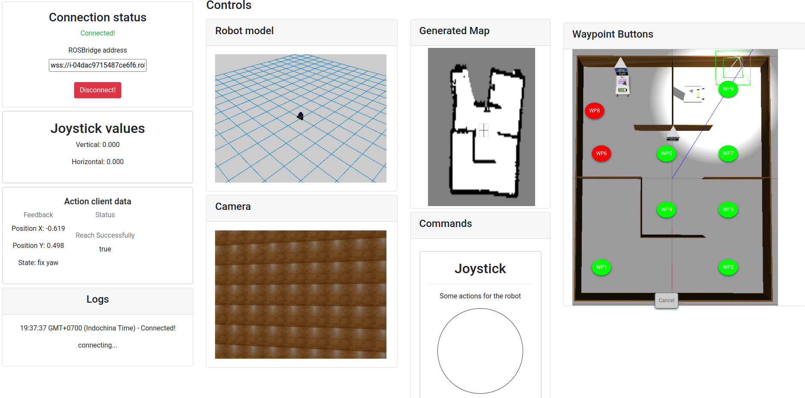
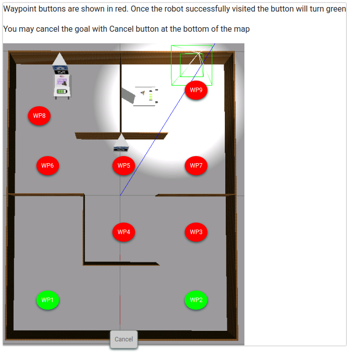
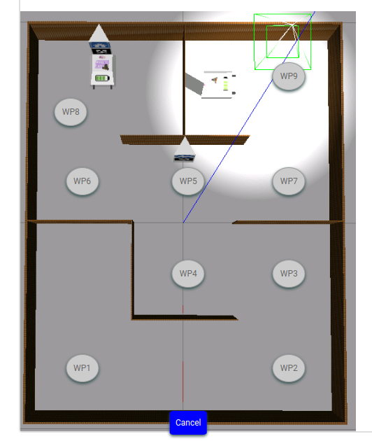
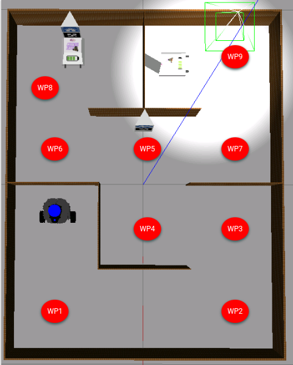
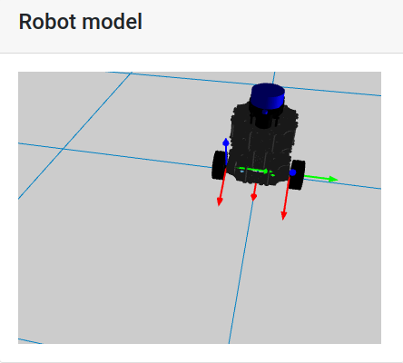

# Checkpoint 21 Web development for Robotics

## Final webpage
The web show joy stick control, 3d robot model, Map that is being generated by mapping server, and the moving image taken by robot camera.




Navigating the robot with button on the map.

Waypoint buttons are shown in red. Once the robot successfully visited the button will turn green



You may cancel the goal with Cancel button at the bottom of the map, while navigating only.



Terminal 1 Simulator

```
source ~/simulation_ws/devel/setup.bash
roslaunch tortoisebot_gazebo tortoisebot_docking.launch
```

Terminal 2 Rosbridge

```
source ~/simulation_ws/devel/setup.bash
roslaunch course_web_dev_ros web.launch
```

Terminal 3 Slam on Rviz

```
source ~/simulation_ws/devel/setup.bash
roslaunch tortoisebot_slam mapping.launch
```

Terminal 4 Action Server

```
source ~/simulation_ws/devel/setup.bash
rosrun course_web_dev_ros tortoisebot_action_server.py
```

Terminal 5 Web Server

```
cd ~/webpage_ws
git clone https://github.com/peerajak/Checkpoint21_WebdevRobotics.git tortoisebot_webapp
```

```
cd ~/webpage_ws/tortoisebot_webapp
python -m http.server 7000
```

Terminal 6 tf2_web server

```
roslaunch course_web_dev_ros tf2_web.launch
```

Terminal 7 Get address

```
rosbridge_address
webpage_address
```

Teleopt commands

```
rosrun teleop_twist_keyboard teleop_twist_keyboard.py
```

Publish a goal to first checkpoint (0.7,-0.48)

```
 rostopic pub /tortoisebot_as/goal course_web_dev_ros/WaypointActionActionGoal "header:
  seq: 0
  stamp:
    secs: 0
    nsecs: 0
  frame_id: ''
goal_id:
  stamp:
    secs: 0
    nsecs: 0
  id: ''
goal:
  position:
    x: 0.7
    y: -0.48
    z: 0.0"
```

### Waypoints 




Waypoint position Data 

wp : location x,y

```
1 : 0.7, -0.48
2 : 0.680851835461391, 0.5046365559674899
3 : 0.21495551839700774, 0.5368169079826496
4 : 0.23105951276897543, 0.04812895919547926
5 : -0.13007296166597881, 0.010690406810986703
6 : -0.18288059001897242, -0.43215748770886586
7 : -0.15489504057272618, 0.4629887743221526
8 : -0.5495752177522534, -0.5476146745173234
9 : -0.6091414439352052, 0.49241421900139143
```

Change mapping.launch. in tortoisebot_slam to change the parameter of the map

```
  <!-- Gmapping -->
  <node pkg="gmapping" type="slam_gmapping" name="tortoisebot_slam_gmapping" output="screen">
    <param name="base_frame" value="base_link"/>
    <param name="odom_frame" value="odom"/>
    <param name="map_update_interval" value="2.0"/>
    <param name="maxUrange" value="4.0"/>
    <param name="minimumScore" value="50"/>
    <param name="linearUpdate" value="1.0"/>
    <param name="angularUpdate" value="0.2"/>
    <param name="temporalUpdate" value="0.5"/>
    <param name="delta" value="0.025"/>
    <param name="lskip" value="0"/>
    <param name="particles" value="120"/>
    <param name="sigma" value="0.05"/>
    <param name="kernelSize" value="1"/>
    <param name="lstep" value="0.05"/>
    <param name="astep" value="0.05"/>
    <param name="iterations" value="5"/>
    <param name="lsigma" value="0.075"/>
    <param name="ogain" value="3.0"/>
    <param name="srr" value="0.01"/>
    <param name="srt" value="0.02"/>
    <param name="str" value="0.01"/>
    <param name="stt" value="0.02"/>
    <param name="resampleThreshold" value="0.5"/>
    <param name="xmin" value="-1.75"/>
    <param name="ymin" value="-1.75"/>
    <param name="xmax" value="1.75"/>
    <param name="ymax" value="1.75"/>
    <param name="llsamplerange" value="0.01"/>
    <param name="llsamplestep" value="0.01"/>
    <param name="lasamplerange" value="0.005"/>
    <param name="lasamplestep" value="0.005"/>

    </node>
```


### Add TF visualization to robot model

